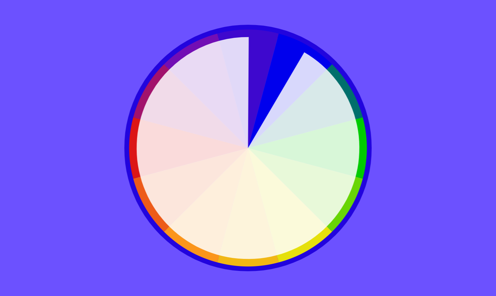
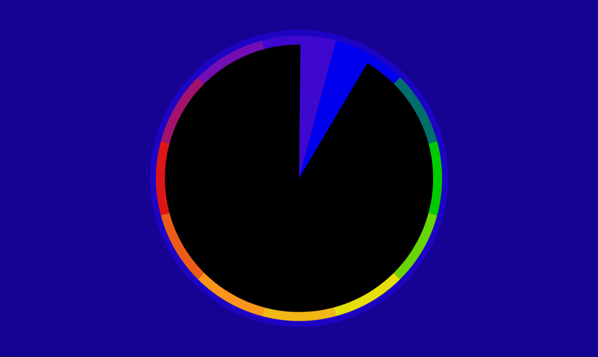

# Chromocron Clock

This app was created for the [flutter clock challenge](https://flutter.dev/clock).

A chromocrom is a color time clock, originally created by Tian Harlan in 1978. Instead of arms, it features a disk with an opening that represents one hour. The current time is to be estimated by the middle of the opening.
The idea behind the clock is to live in the moment instead of focusing on the current minute.

Screenshots:

Light Mode

Dark Mode 

### Get started

After you installed flutter, clone this repository and run
* flutter create .
* flutter run 